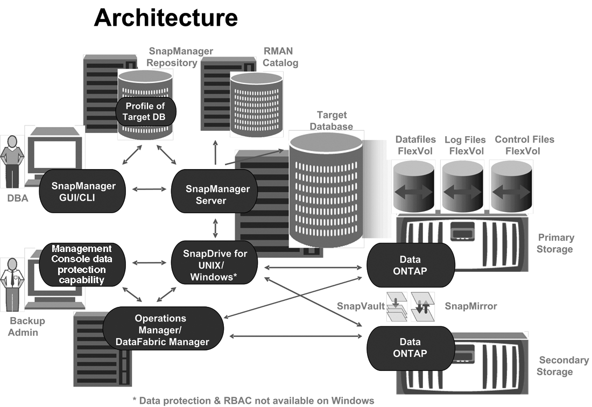

= Oracle架構的功能SnapManager
:allow-uri-read: 
:icons: font
:imagesdir: ../media/

[role="lead"]
適用於Oracle的支援架構包含許多元件、SnapManager 例如SnapManager 適用於Oracle主機、用戶端和儲存庫的支援。其他元件包括一線和二線儲存系統、以及其他NetApp產品。

適用於Oracle的支援架構包括下列架構元件：SnapManager

* 支援SnapManager
* 圖形化使用者介面或命令列介面SnapManager
* 系統儲存庫SnapManager
* 主儲存系統
* 二線儲存系統
* 適用於Windows SnapDrive

下圖顯示SnapManager Oracle及相關元件的架構：

